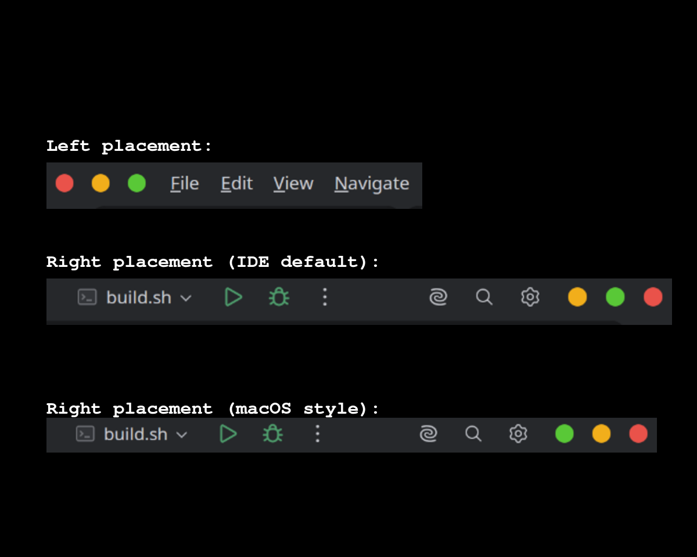

<h1 align="center">
  
  <br>
  Traffic Light Buttons
</h1>

<p align="center">
    <a href="https://github.com/sponsors/ddc"></a>
    <br>
    <a href="https://ko-fi.com/ddc"></a>
    <a href="https://www.paypal.com/ncp/payment/6G9Z78QHUD4RJ"></a>
    <br>
    <a href="https://github.com/ddc/JetbrainsTrafficLightButtons/blob/main/LICENSE"></a>
    <a href="https://github.com/ddc/JetbrainsTrafficLightButtons/releases/latest"></a>
    <br>
    <a href="https://github.com/ddc/JetbrainsTrafficLightButtons/issues"></a>
    <a href="https://github.com/ddc/JetbrainsTrafficLightButtons/actions/workflows/workflow.yml"></a>
    <a href="https://actions-badge.atrox.dev/ddc/JetbrainsTrafficLightButtons/goto?ref=main"></a>
</p>

<p align="center">Replaces Close/Minimize/Maximize window buttons with macOS-style traffic light buttons for all JetBrains IDEs (Linux only)</p>

<p align="center">📦 <b><a href="https://plugins.jetbrains.com/plugin/30756-traffic-light-buttons">Install from JetBrains Marketplace</a></b> 📦 </p>


# Table of Contents

- [Screenshot](#screenshot)
- [Features](#features)
- [Installation](#installation)
- [Settings](#settings)
- [Build](#build)
- [License](#license)
- [Support](#support)


# Screenshot

<p align="left">
  
</p>


# Features

- LINUX ONLY (macOS already has native traffic lights; Windows support planned for a future release)
- macOS-style traffic light buttons (red/yellow/green)
- Four button states: active, hover (with action icons), pressed, and inactive (gray)
- Configurable button placement (left or right side of the title bar)
- Compatible with all JetBrains IDEs (2025.3.3+)


# Installation

## From Marketplace

1. In your JetBrains IDE, go to **Settings > Plugins > Marketplace**
2. Search for **Traffic Light Buttons**
3. Click **Install** and restart the IDE


## From Plugin ZIP

1. Download the latest `TrafficLightButtons-*.zip` from [Releases](https://github.com/ddc/JetbrainsTrafficLightButtons/releases)
2. Go to **Settings > Plugins > Install Plugin from Disk...**
3. Select the downloaded `.zip` file and restart the IDE


# Settings

`Settings > Appearance & Behavior > Traffic Light Buttons`

- **Button Placement** — Left or Right (default: Right)
- **Button Order** — IDE Default or macOS Style (only available for Right placement)
  - **IDE Default**: Minimize, Maximize, Close
  - **macOS Style**: Maximize, Minimize, Close


# Build

```bash
./build.sh
```

# License

This project is licensed under the [Apache 2.0 License](LICENSE).


# Support

If you find this project helpful, consider supporting development.

<a href='https://github.com/sponsors/ddc' target='_blank'></a>
<a href='https://ko-fi.com/ddc' target='_blank'></a>
<a href='https://www.paypal.com/ncp/payment/6G9Z78QHUD4RJ' target='_blank'></a>
